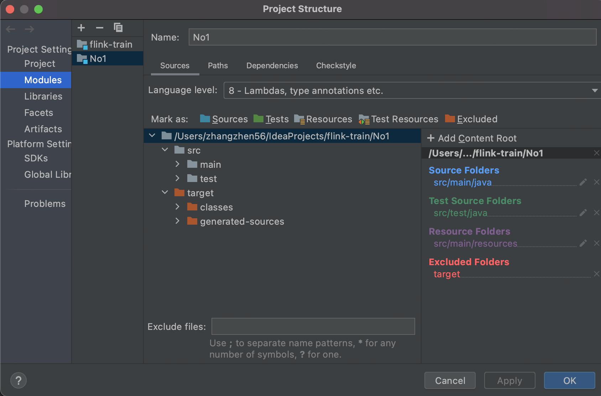
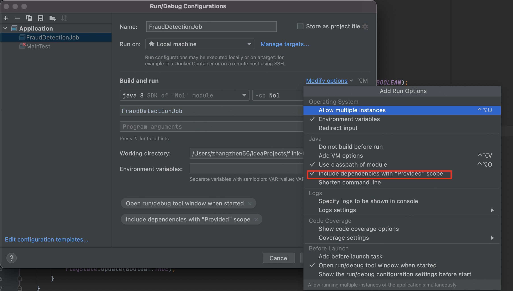
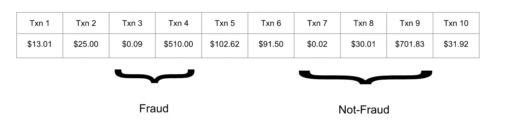
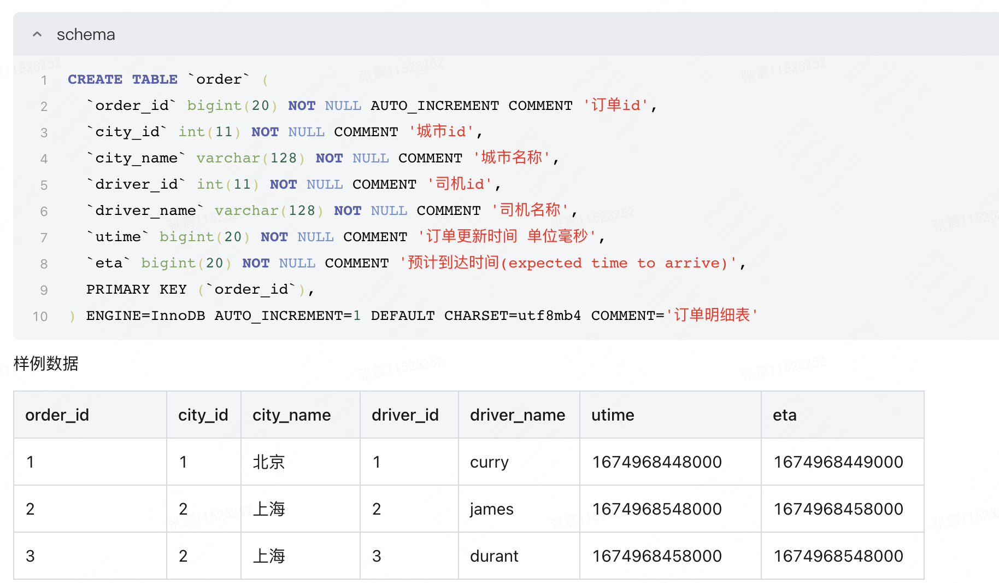
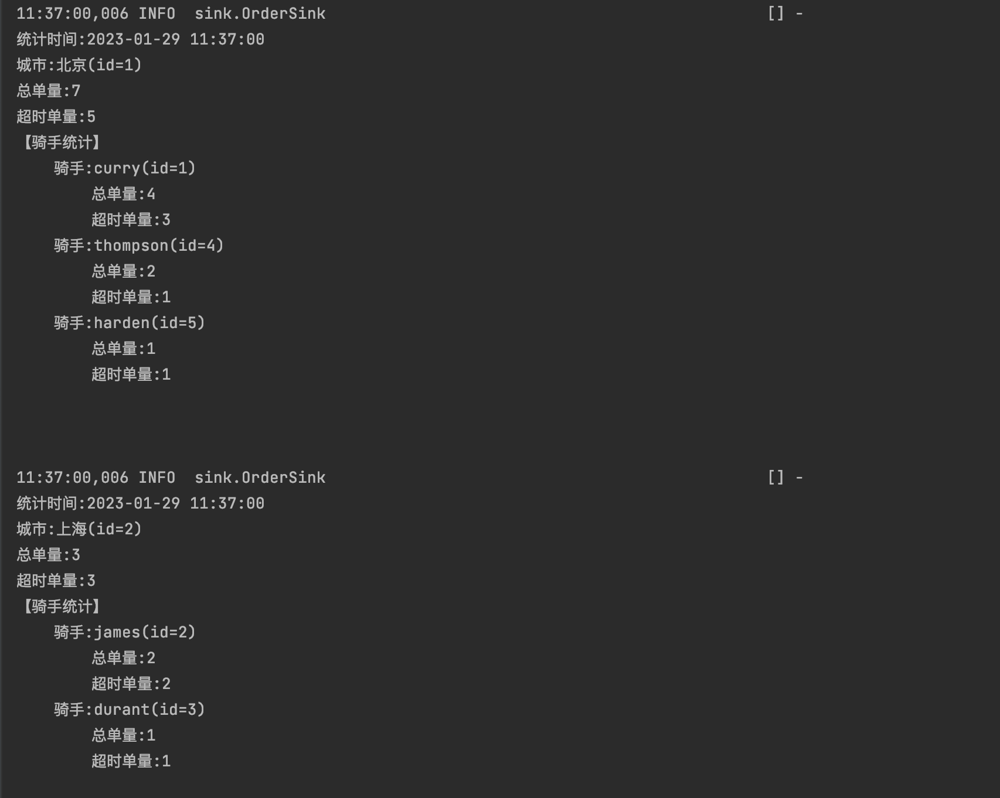

## week1

### 1. 安装IDEA开发工具
推荐使用IDEA作为编码工具，方便集成。
安装链接： https://www.jetbrains.com/idea/download/#section=mac
社区版即可

### 2. 导入flink-train
导入flink-train项目，后添加No1到项目中，如图所示

### 3. 运行FraudDetectionJob
确保能运行成功，观察控制台输出。
运行前记得开启如下图所示选项

### 4.解决实际问题，完成下面的题目
背景：信用卡欺诈在数字时代日益受到关注。犯罪分子通过实施诈骗或侵入不安全的系统来窃取信用卡号。通过一次或多次小额购买来测试被盗号码，通常是一美元或更少。如果可行，他们就会购买更多重要物品，以获得可以出售或自己保留的物品。在这一环节，你将构建一个欺诈检测系统，用于对可疑的信用卡交易发出警报。使用一组简单的规则，你将看到 Flink 如何让我们实现高级业务逻辑并实时行动。
题目：欺诈检测器应该为进行小额交易后立即进行大额交易的任何账户输出警报。在这里我们定义：当交易额低于1.00美元视为小额交易，当交易额高500.00美元视为大额交易。想象一下您的欺诈检测器处理特定帐户的以下交易流。

交易 3 和 4 应该被标记为欺诈，因为它是一笔小交易，0.09 美元，然后是一笔大交易，510 美元。或者，交易 7、8 和 9 不是欺诈，因为小额 0.02 美元并没有紧跟着大额交易；相反，有一个打破模式的中间交易。

为此，欺诈检测器必须记住跨事件的信息；只有在前一笔交易规模较小的情况下，一笔大额交易才是欺诈性的。跨事件记住信息需要状态，这就是我们决定使用**KeyedProcessFunction**的原因。它提供了对状态和时间的细粒度控制，这将使我们能够在整个演练中根据更复杂的要求改进我们的算法。

可能用到的知识点：KeyedProcessFunction、ValueState

## week2
### 需求描述
同城货运公司Alpha需要实时统计一些核心的运营指标。数据团队已经从业务数据库中同步来订单明细数据。如下图所示，一条订单记录包括订单id、城市id、城市名称、司机id、司机名称、订单更新时间和订单预计到达时间。

产品同学提出的需求是，每10s更新全天的城市粒度和司机粒度的接单量及超时单量。需要考虑的细节包括

1、去重问题。订单量和超时单量统计的都是去重过的结果。同时上游数据源可能有重复的记录，即一条记录多次下发。

2、转单问题。一个订单可能会多次流转，指派给不同司机，避免重复统计。
> 转单定义：：一个订单先指派给一个司机，之后指派给另一个司机。一个订单某一个时刻只对应一个有效司机。

OvertimeCountJob.java已经定义了整体骨架，你需要完成核心类(OvertimeCounter.java)的编码。

当你完成编码后，统计结果应类似下图
