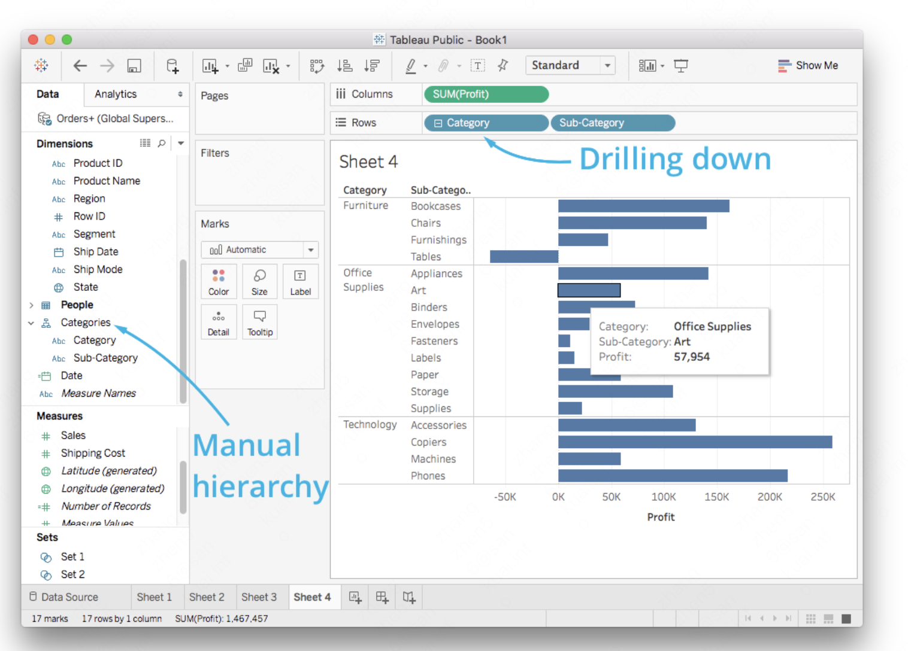

## week1

### 1. 安装tableau public
安装链接： https://public.tableau.com/s/.
tableau public可免费使用，并且足以满足我们日常数据分析需求。

### 2. 连接数据源
tableau可以连接多种数据源，例如Excel、文本文件、 statistical files(例如来自SAS, SPSS, and R的文件）。同时支持远程链接mysql等，
当前使用数据集：global-superstore.xlsx

### 3. Uion&Join

### 4. 创建worksheet

### 5. Aggregation 聚合 
可以通过右键单击三角形来选择正在执行的聚合类型。要更改聚合方法，选择“度量”，然后选择“总和”、“平均值”、“中位数”等。

### 6. Granularity 粒度
Granularity为粒度。
通过如下图所示方式，将market当做图表的粒度，那么现在图表根据market粒度来聚合数据
横纵坐标仍是聚合的quantity和profit，但它是groupby market的。

### 7. drill down 下钻

根据时间类型自动下钻

YEAR(OrderDate)、QUARTER(OrderDate)，可下钻

设置手动下钻

### 8. build map
按照
https://help.tableau.com/current/pro/desktop/en-us/maps_build2.htm

## week2

### 1. 理解tableau中worksheets&dashboards&stories的关系

### 2. create your stories
Stories are great for a narrated walkthrough of the discoveries you made in your data. They are similar to dashboards in that you create sheets, then drag the sheets to the story. However, each sheet is displayed separately along with narrative text in sequential series.

Below is a story I made looking into why the Global Superstore is losing money in some countries.

复刻出上图所示的报告，外加一些自己的思考，把你的故事讲清楚。 

